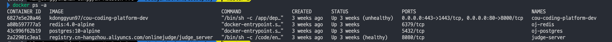

## Installation 
사전에 Docker가 설치되어있어야 합니다.   

```shell
> git clone https://github.com/OnlineJudgePlatformDev/COUDeploy.git
> cd COUDeploy
> docker-compose up -d
```   

<br />   

이후 ```docker ps -a``` 를 실행하게 되면 다음과 깉이 4개의 컨테이너가 구동되고 있는 것을 확인 할 수 있습니다.   

<p align="center"></p>   


정상적으로 4개가 보인다면 실행 후 [http://localhost](http://localhost) 접속하면 끝납니다.   
   
<br />   

> #### :no_entry_sign: Issue   

Chrome 기준 특정 버전 이상부터는 크롬 정책으로 인해 ```http://localhost``` 접속시 강제로 ```https://localhost ```로 리다이렉트되는 경우가 있습니다. (이 외에 다른 브라우저에서도 안 될 수 있음.)
이를 해결하기 위해서는 원칙상 SSL 인증서를 갱신하는게 올바르나, 개발도중 로컬에서 매번 인증서를 갱신하기에는 무리가 있으므로, 임시로 리다이렉트를 하지 않도록 설정하는 방식으로 진행한다.   


<br />   

```chrome://flags/#allow-insecure-localhost``` 로 접속 후 ```Allow invalid certificates for resources loaded from localhost. ``` 항목을 <b>Enabled</b> 로 변경   

<br />   

<br />   
<br />   


## Project Hierarchy   
프로젝트 기본 계층    

```ruby   

 COUDeploy
 │── backend
 └── frontend
 ```  

<br />   

> <b>바로가기</b>   

[backend](/Wiki/backend)    
[frontend](/Wiki/frontend)   
<!-- [docker](/Wiki/dockerwiki)    -->

<br />   
<br />   
