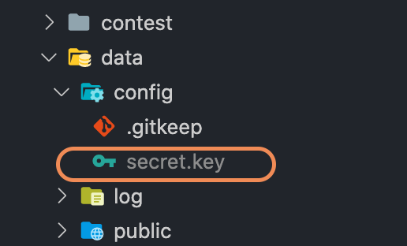

## BACKEND 개발환경 세팅 하기   

<br />   
<br />   
   

Backend의 경우 개발 방법이 크게 두 가지로 나뉩니다.

1. docker에서 실행되고 있는 이미지를 실시간으로 반영하면서 개발하는 방법
2. python 가상환경(venv)를 사용하여 개발하는 방법


------

### 1번 방식   

<br />   

> #### STEP 1. 환경 구성하기   

<br />

우선 도커 이미지를 받아와 실행을 구성합니다.

```shell
> git clone https://github.com/OnlineJudgePlatformDev/COUDeploy.git
> cd COUDeploy
> docker-compose up -d
```   

위 명령어를 진행하면 다음과 같이 프로젝트가 구성 되며 docker 컨테이너가 실행 중일 것입니다.


```python
COUDeploy
  │── backend
    │── account
    │── announcement
    │── conf
    │── contest
    │── problem 
    │── submission #
    │── judge 
    │── utils
      .
      .
      .
    │── fps
    └── oj
  │── data
  └── frontend
 ```  
 
<br />   

또한 터미널에서 아래 명령어를 실행하면 다음과 같이 4개의 이미지가 실행되는 것을 확인 할 수 있습니다.

```ruby
> docker ps -a
 ```

 <p align="center"></p>   

<br />
<br />

> #### STEP 2. 개발하기   

<br />   

개발하기 앞서 먼저 디렉토리 이동을 합니다.

<br />   

```shell
> cd backend   
 ```

<br />   

backend 디렉토리가 개발 할 루트 디렉토리라고 보시면 됩니다.
그 안에 account, announcement 등 각각의 하위 폴더는 각 기능 별 모델이라고 보면 됩니다.

그 안에서 코드들을 수정 및 생성 등 필요한 개발을 진행하시면 됩니다.


<br />   
<br />   


> #### STEP 3. 도커 컨테이너에 반영하기   

<br />   

개발이 완료되었다면, 실행중인 컨테이너에 반영해야합니다.
만약 <b>account</b> 폴더에 있는 어떤 파일을 수정했다고 가정해보겠습니다.

앞서 말했듯, backend 폴더 안에 있는 각 폴더는 그 자체가 하나의 모델이라고 보면 된다고 했습니다.

이를 docker 에 반영시키는 방법은 다음과 같습니다.

<br />   

```shell
> docker cp [model 명] cou-coding-platform-dev:/app
 ```

<br />   

예시로 들자면, account 폴더 내 어떤 임의의 파일이 수정되었을 경우 다음과 같이 명령어를 입력해주면 됩니다.

<br />   

```shell
# dir : COUDeploy/backend
> docker cp account cou-coding-platform-dev:/app
 ```

<br />   

위 명령어를 입력하게 되면 컨테이너에 반영이 됩니다.
다만, 어떤 파일들은 컨테이너를 재시작해야만 반영되는 경우가 있으므로, 반영이 되지 않을 경우 컨테이너를 재시작해주시면 됩니다.

<br />

#### 주의 :exclamation: 

backend 파일 중 conf, fps, judge, utils 는 위와같이 하시면 안됩니다.

<br />
<br />

---

### 2번 방식   

<br />

#### BACKEND 개발 모듈   

python 가상환경(venv)를 사용하는 방법입니다.
(개발환경이 꼬이지 않도록 가상환경으로 진행하기 위해서 가상환경(venv)를 사용)   

<br />   
<br />   

#### 세팅방법    
   
<br />   

> #### STEP 1. 환경 구성하기   


 ```ruby   
 # cd COUDeploy/
> sudo apt install -y python3-venv
> python3 -m venv venv
> source venv/bin/activate
> pip3 install -r backend/deploy/requirements.txt   

 ```   

<br />   


>> :no_entry_sign: <b> Issue1.</b>   
만약 <b>ERROR: Could not find a version that satisfies the requirement psycopg2==2.9.2</b> 가 날 경우 <b>pip install psycopg2-binary</b> 로 설치 후 다시 pip3 install -r back/deploy/requirements.txt 진행   

<br/>   
<br/>   
<br/>   

>> :no_entry_sign: <b> Issue2.</b>   
Issue1 을 하고도 설치 에러가 난다면 postgresql 가 설치되어있지 않거나 path가 잡혀있지 않은 경우이므로 다음과 같이 명령어 실행 후 다시 설치해줍니다.   
   

<b>[Ubuntu]</b>   

```ruby
> sudo apt-get install libpq-dev python-dev
 ```
   

      
<b>[MacOS]</b>
```ruby
> brew install postgresql
 ```

<br/>   
<br/>   

> #### STEP 2. 파일 구성하기   

<br />   

Django는 암호화 인증에 사용되는 비밀키인 <b>SECRET_KEY</b> 가 프로젝트마다 유일한 값으로 세팅되어있어야 함.   

이는 깃허브에 올라갈 때 노출되면 안되기 떄문에 프로젝트를 clone을 하더라도 SECRET_KEY가 없기 떄문에 새로 생성해줄 필요가 있습니다.

<br/>    

1) <b>secret key 생성하기</b>   
	아래 링크를 통해 키를 생성해줍니다.
	\>\>\> [key 생성 사이트](https://miniwebtool.com/django-secret-key-generator/)   
	<br />   

2) <b>파일 구성하기</b>   
	아래와 같이 동일한 이름으로 파일을 생성 한 뒤 해당 파일 내용을 1번 과정에서 얻은 키 내용을 복사 및 저장을 합니다.   


<p align="center"></p>   


<br />   

> #### STEP 3. 실행하기   

<br />   


 ```ruby
# cd COUDeploy/backend
> python manage.py runserver
 ```   


<br />   
<br />   

### Module Test in Local env.   

로컬 모듈 테스트시 DB를 올려야 하기 때문에  ```init_db.sh``` 을 통해 DB를 띄워야 합니다.

 ```ruby
# cd COUDeploy/backend
 > ./init_db.sh
 > python3 manage.py migrate
 ```   
<br />   

이후 DB 를 보면 다음과 같이 두 개의 DB가 docker container로 생성 되는 것을 볼 수 있습니다..   

``` ruby
docker ps
CONTAINER ID   IMAGE              COMMAND                  CREATED         STATUS         PORTS                      NAMES
7c43ceed847e   redis:4.0-alpine   "docker-entrypoint.s…"   4 minutes ago   Up 4 minutes   127.0.0.1:6380->6379/tcp   oj-redis-dev
c37ac7670c83   postgres:10        "docker-entrypoint.s…"   4 minutes ago   Up 4 minutes   127.0.0.1:5435->5432/tcp   oj-postgres-dev
 ```


<br/>   
<br/>     
<br />   
<br />   

### 전체 반영(Docker) 테스트   

back 안에서 개발을 완료했을 경우 해당 사항을 바로 반영해보고 싶다면, 앞서 했던 것 처럼 docker에 반영하고자 하는 폴더를 copy하면 됩니다.   
예로들어 announcement 폴더 내용을 반영시키고 싶다면 다음과 같이 docker에 반영시킵니다.    

``` ruby
> docker cp announcement cou-coding-platform-dev:/app
```   
<br />   

이 때 docker를 재시작 해야 할 수 있다.


<br />   
<br />   

## Backend Hierarchy   
백엔드 계층    

```python
 back
 │── account # 사용자 계정 관리
 │── announcement # 공지사항
 │── article # 게시판 / 게시글 관리
 │── conf # 설정 구성
 │── contest # 대회 관리
 │── data 
 │── deploy # 도커 배포 설정
 │── docs # README, update 기록
 │── fps
 │── image # 메인 이미지 관리
 │── judge # 문제 채점 
     │── dispatcher.py
     │── languages.py
     └── tasks.py
 │── oj # 설정 파일
     │── settings.py # 프로젝트 설정 파일
     │── dev_settings.py # 개발 모드 설정 파일 - settings.py에서 import함
     │── production_settings.py # 운영 모드 설정 파일 - settings.py에서 import함
     │── urls.py # 프로젝트의 ROOT URLconf - 요청한 URL에 해당하는 View를 호출하기 위해 해당 파일을 먼저 확인
     └── wsgi.py # 현재 프로젝트를 서비스하기 위해 웹 서버와 WSGI 규격으로 연동하기 위한 파일
 │── options
 │── problem # 문제 관리
 │── submission # 문제 제출
 │── utils # 프로젝트 내에서 사용하는 유틸리티
 │── .coveragerc # 테스트 시 커버리지 측정 설정 파일 - omit(테스트에서 제외)
 │── .dockerignore # Docker 빌드 내용 설정
 │── .flake8 # 코드 정적 분석 설정 - exclude(분석에서 제외)
 │── .gitignore
 │── .travis.yml
 │── Dockerfile
 │── init_db.sh
 │── manage.py # 프로젝트와 상호작용하는 커맨드라인 유틸리티 / 장고 명령어 처리
 └── run_test.py # 테스트 
 ```  
 
<br />   
<br />   


# account 모듈
## model - User
| 열 이름 | 데이터 형식 | Null 허용 | Default Value | etc |
| -------------------------------  | -------- | - | -------------------- | --------- |
| username                         | text     |     |  | unique |
| email                            | text     | ☑️ |  |  |
| create_time                      | datetime | ☑️ |  | auto_now_add |
| admin_type                       | text     |     | AdminType.REGULAR_USER |  |
| problem_permission               | text     |     | ProblemPermission.NONE |  |
| reset_password_token             | text     | ☑️ |  |  |
| reset_password_token_expire_time | datetime | ☑️ |  |  |
| auth_token                       | text     | ☑️ |  |  |
| two_factor_auth                  | boolean  |    | false |  |
| tfa_token                        | text     | ☑️ |  |  |
| session_keys                     | json     |  | list |  |
| open_api                         | boolean  |    | false |  |
| open_api_appkey                  | text     | ☑️ |  |  |
| is_disabled                      | boolean  |  | false |  |
### User 모델은 AbstractBaseUser을 상속받는 객체로 id, password, last_login를 사용할 수 있음

## model - UserProfile
| 열 이름 | 데이터 형식 | Null 허용 | Default Value | etc |
| -------------------------------  | -------- | - | -------------------- | --------- |
| user                             | User     |     |  | OneToOne(User) |
| acm_problems_status              | json     |  | dict |  |
| oi_problems_status               | json     |  | dict |  |
| real_name                        | text | ☑️ |  |  |
| avatar                           | text |     | /public/avatar/default.png |  |
| blog                             | url     | ☑️ |  |  |
| mood                             | text     | ☑️ |  |  |
| github                           | text     | ☑️ |  |  |
| school                           | text     | ☑️ |  |  |
| major                            | text     | ☑️ |  |  |
| language                         | text     | ☑️ |  |  |
| accepted_number                  | Integer     |  | 0 |  |
| total_score                      | BigInteger     |  | 0 |  |
| submission_number                | Integer     |  | 0 |  |

## Register - /back/account/views/oj.py - UserRegisterAPI
1 - POST 요청(로그인 폼)을 받음</b>   
2 - option.py(/back/option/)의 SysOptions.allow_register을 통해 회원가입이 허가되었는지 확인 - 실패 메세지 전송</b>   
3 - request의 data의 'username', 'email' 데이터를 소문자로 변경</b>   
4 - 요청에 따른 Captcha(/back/utils/captcha/__init__.py) 객체 생성</b>   
5 - Captcha 통과 여부, username, email 중복 여부 확인 - 실패 메세지 전송</b>   
6 - date의 username, email을 통해 User 객체 생성(INSERT SQL 수행)</b>   
7 - 생성한 User 객체에 data의 password 저장(INSERT SQL 수행)</b>   
8 - save()함수를 통해 DB에 저장</b>   
9 - 성공 메세지 전송</b>   
##### 쿼리셋을 json화 하여 Response를 리턴하되 데이터 validation을 위해 /back/account/serializers.py의 UserRegisterSerializer 사용
UserRegisterSerializer의 내부에선 위 회원가입 API에서 사용되는 데이터인 username, password, email, captcha에 대한 validation이 이루어짐</b>   
username - CharField(max_length=32)</b>   
password - CharField(min_length=6)</b>   
email    - EmailField(max_length=64)</b>   
captcha  - CharField()</b>   
